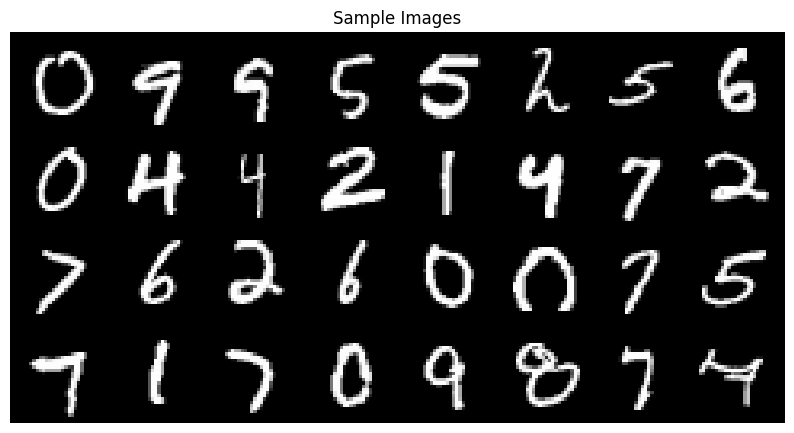
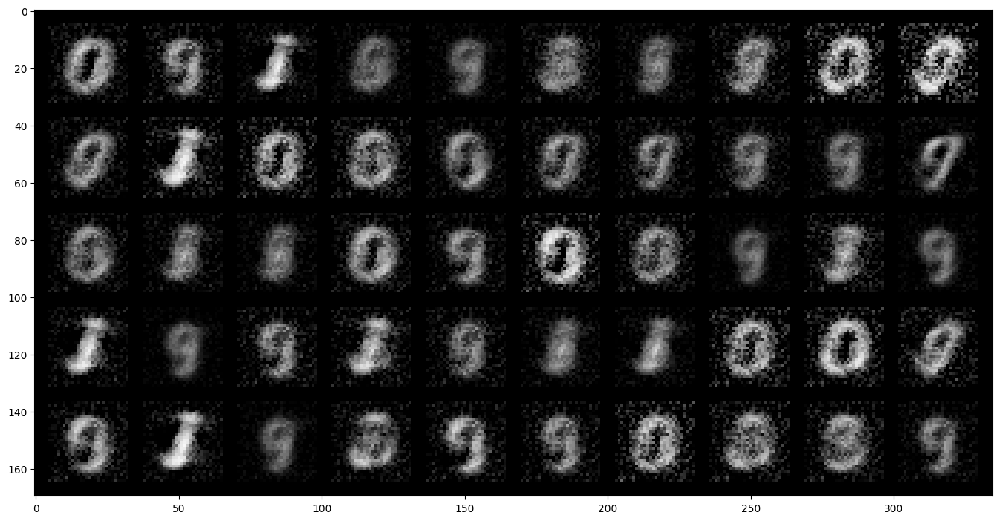

# Deep Learning-based Digit Recognition Using MNIST Dataset

## Abstract

This project focuses on handwritten digit recognition using deep learning techniques. It leverages the MNIST dataset and applies a custom-built neural network implemented in PyTorch. The steps include data preprocessing, model development, training, and evaluation. This project lays the foundation for understanding deep learning models in image classification tasks.

## Introduction

Handwritten digit recognition is a fundamental problem in machine learning and computer vision. The MNIST dataset, with 60,000 training and 10,000 test images (digits 0–9), is a standard benchmark.

This project implements a simple feedforward neural network for digit recognition, including manual dataset handling, custom model building, training, and visualization.

## Dataset Overview

The MNIST dataset contains grayscale images of handwritten digits (28x28 pixels). Preprocessing steps:

- **Normalization**: Scaling pixel values to [0,1] using `transforms.ToTensor()`
- **Batching**: Dividing into batches of size 32

Data loading is handled with PyTorch’s `DataLoader`, with shuffling for training batches.

## Model Architecture

The neural network model has:

- **Input Layer**: Flattened 784-dimensional vector
- **Hidden Layers**: ReLU activations for non-linearity
- **Output Layer**: 10 outputs (digits 0–9)

Implemented using PyTorch’s `nn.Module`.

### Example Architecture:

- Linear(784, 128)
- ReLU
- Linear(128, 64)
- ReLU
- Linear(64, 10)

*Note: More complex models often use CNNs for MNIST.*

## Training Strategy

Manual training loop steps:

- **Loss Function**: CrossEntropyLoss (for multi-class classification)
- **Optimizer**: SGD (Stochastic Gradient Descent)
- **Epochs**: Multiple iterations over the training set
- **Backpropagation**: Using gradient descent

### Pseudocode of Training Loop:

```
for epoch in range(num_epochs):
    for images, labels in train_loader:
        images = images.view(-1, 28*28)
        outputs = model(images)
        loss = criterion(outputs, labels)

        optimizer.zero_grad()
        loss.backward()
        optimizer.step()
```

Loss was printed periodically, although no formal plots were generated.

## Evaluation and Results

The project focused mainly on training. Full evaluation (accuracy, confusion matrices) was not implemented but recommended steps would include:

- `model.eval()` mode
- `torch.no_grad()` context
- Computing classification accuracy

Expected accuracy: **92%–96%**.

## Visualizations

Visualizations help understand the dataset quality and the training progress.

### Sample batch of MNIST digits

This figure shows a grid of raw MNIST input images, helping verify data loading correctness and the diversity of handwritten digits.



### Additional visualization showing processed digits

This figure displays more blurred or generated-looking images, highlighting possible noisy conditions that might challenge classification models.



These visualizations provide valuable insights into data quality and potential training challenges.

## Conclusion

This project demonstrates a complete pipeline for handwritten digit classification with deep learning. Key learning points:

- Data preprocessing and loading
- Designing a simple neural network
- Implementing a manual training loop
- Visualizing sample data

### Limitations:

- No formal model evaluation
- No tracking/plotting of loss and accuracy
- Potential underfitting due to simple architecture

### Future Work:

- Implement test set evaluation
- Add training/validation loss plots
- Use Convolutional Neural Networks (CNNs)
- Perform hyperparameter tuning

## References

- LeCun, Y., Bottou, L., Bengio, Y., & Haffner, P. (1998). Gradient-based learning applied to document recognition. *Proceedings of the IEEE*.
- [PyTorch Documentation](https://pytorch.org/docs/stable/index.html)
- [MNIST Database](http://yann.lecun.com/exdb/mnist/)
